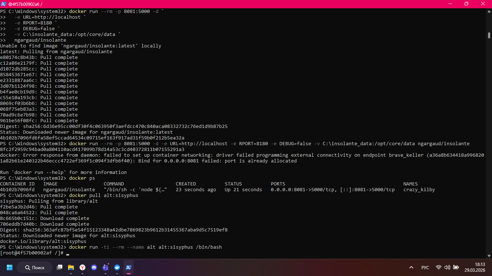
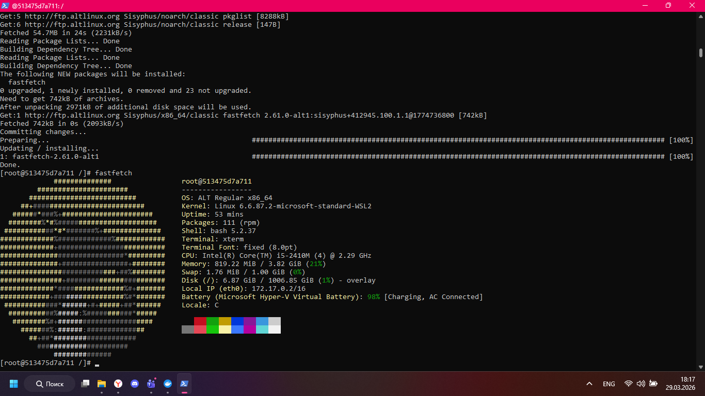

## Команды

```powershell
docker pull alt:sisyphus
docker run -ti --rm --name alt alt:sisyphus /bin/bash
```



## Проверка

```powershell
apt-get update
apt-get install fastfetch
fastfetch
exit
```

