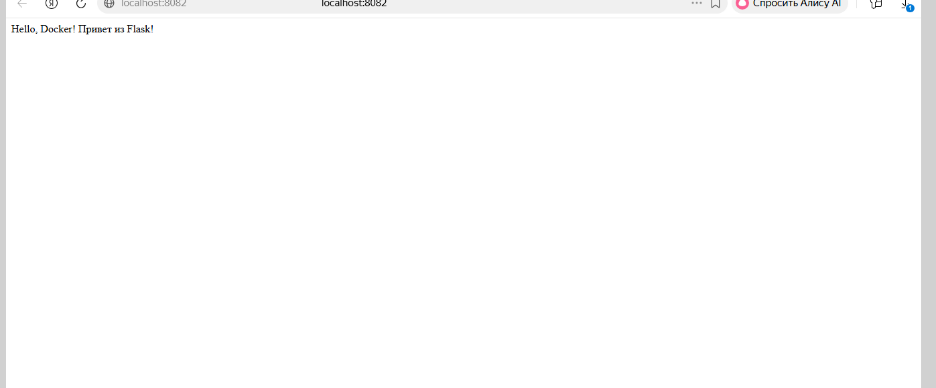
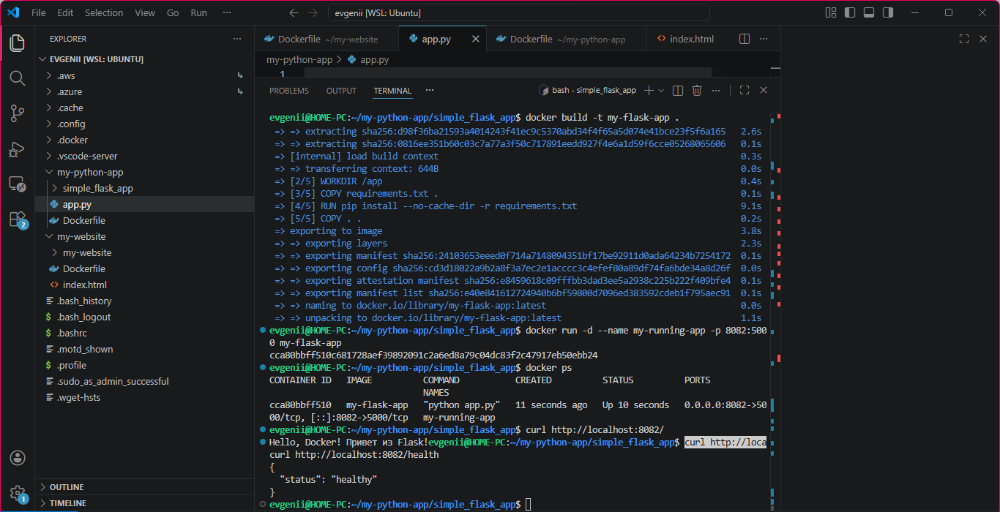

# Практическая работа: Контейнеризация Flask-приложения в Docker

## Цель работы
Научиться создавать Docker-образ для Python-приложения на базе фреймворка Flask, запускать контейнер и проверять его работоспособность через браузер.

## Задача
Разработать простое веб-приложение на Flask, упаковать его в Docker-контейнер, запустить с пробросом порта и проверить работу эндпоинтов.

---

## 1. Структура проекта

Создайте структуру проекта одной командой:

```bash
mkdir -p simple_flask_app && cd simple_flask_app && touch app.py requirements.txt Dockerfile .dockerignore



simple_flask_app/
├── app.py              # Flask-приложение
├── requirements.txt    # Зависимости Python
├── Dockerfile          # Инструкции для сборки образа
└── .dockerignore       # Исключения для сборки