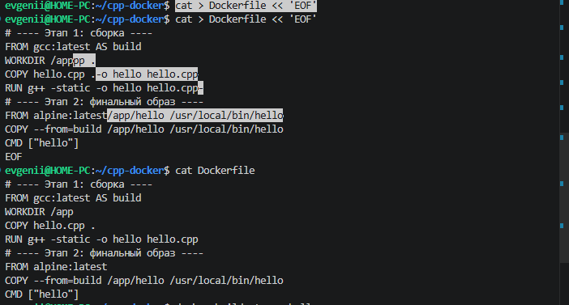
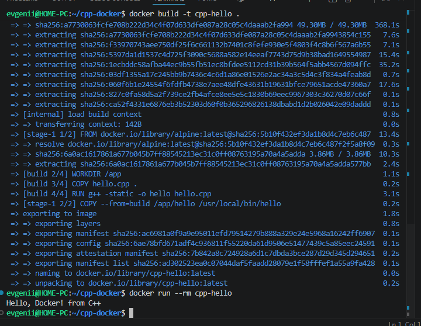

## Цель работы
Научиться создавать Docker-образ для C++ приложения с использованием многоэтапной сборки (multi-stage build), запускать контейнер и исследовать его работу.

## Задача
Разработать консольное приложение на C++, которое выводит приветственное сообщение, упаковать его в Docker-контейнер с оптимизацией размера финального образа, запустить и проверить работу.

---

## 1. Структура проекта

Создайте структуру проекта одной командой:

```bash
mkdir -p cpp-docker && cd cpp-docker && touch Dockerfile hello.cpp

