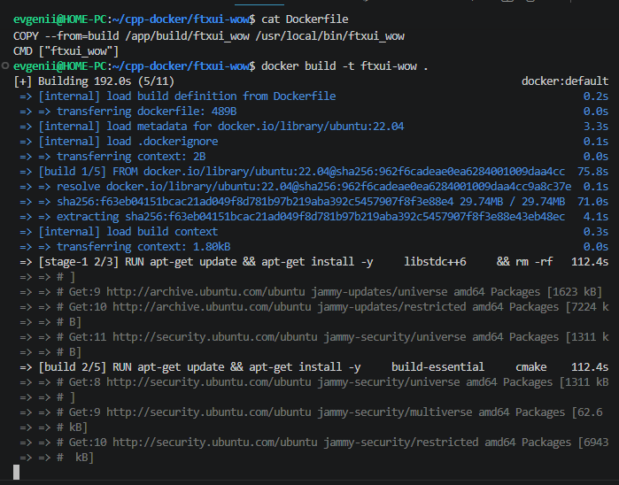
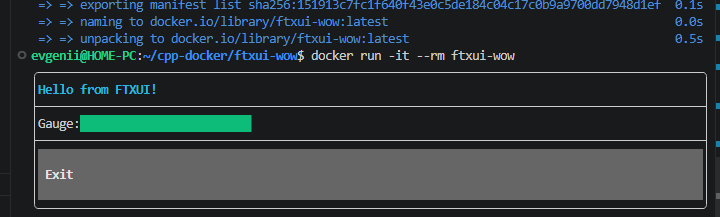

## Цель работы
Научиться создавать Docker-образ для C++ приложения с графической библиотекой FTXUI (терминальный интерфейс), используя многоэтапную сборку, а также запускать интерактивное псевдографическое приложение в контейнере.

## Задача
Разработать терминальное приложение на C++ с анимированным интерфейсом (бегущий индикатор, кнопка выхода), упаковать его в Docker-контейнер с использованием FTXUI библиотеки, запустить с поддержкой интерактивного терминала.

---

## 1. О библиотеке FTXUI

**FTXUI** (Functional Terminal User Interface) — это библиотека для создания современных терминальных интерфейсов на C++. Она позволяет создавать:
- Интерактивные меню
- Кнопки и формы
- Графики и индикаторы
- Анимацию в терминале

Особенности FTXUI:
- Кроссплатформенность (Linux, macOS, Windows)
- Поддержка мыши и клавиатуры
- Современный C++17
- Асинхронное обновление интерфейса

---

## 2. Структура проекта

Создайте структуру проекта одной командой:

```bash
mkdir -p ftxui-wow && cd ftxui-wow && touch Dockerfile main.cpp CMakeLists.txt