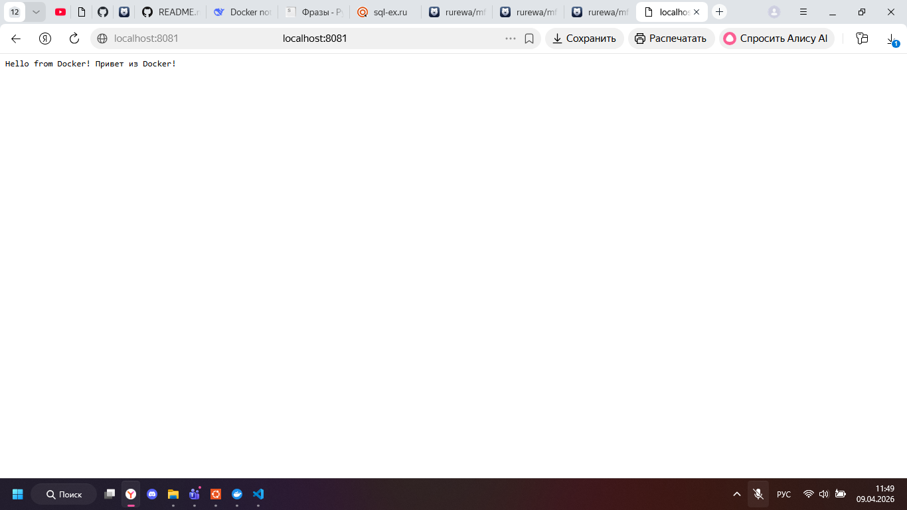
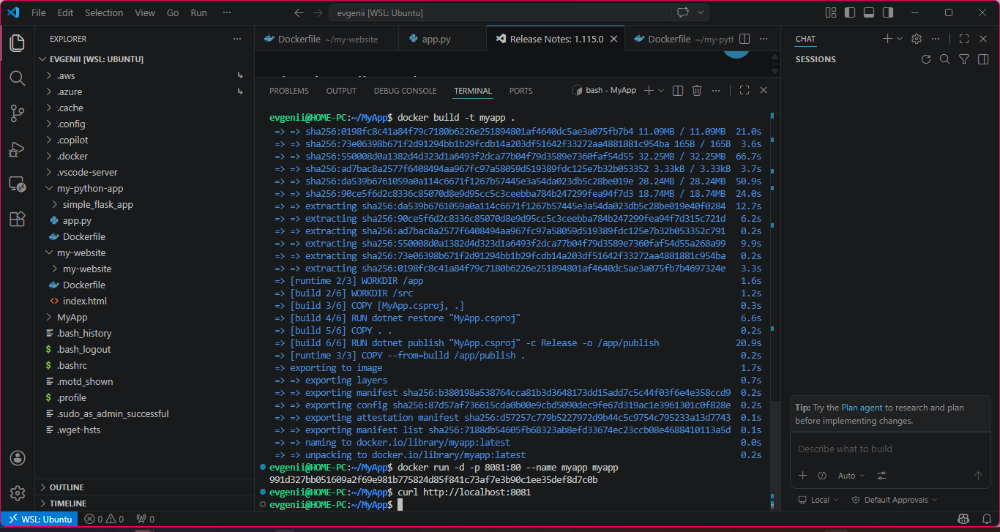

## Цель работы
Научиться создавать Docker-образ для веб-приложения на платформе .NET 8 (ASP.NET Core), запускать контейнер и проверять его работоспособность через браузер.

## Задача
Разработать минимальное веб-приложение на ASP.NET Core, упаковать его в Docker-контейнер с использованием многоэтапной сборки (multi-stage build), запустить с пробросом порта и проверить работу.

---


## 1. Структура проекта

Создайте структуру проекта одной командой:

```bash
mkdir -p MyApp && cd MyApp && touch Program.cs MyApp.csproj Dockerfile