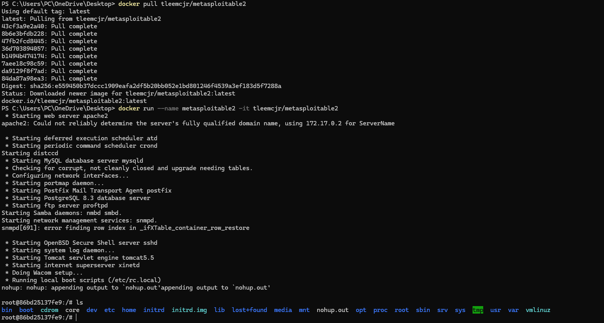

## Команды

```powershell
docker pull tleemcjr/metasploitable2
docker run --name metasploitable2 -it tleemcjr/metasploitable2
```

## Проверка

После запуска я убедился, что контейнер стартует и доступна консоль внутри контейнера.


Для завершения работы я использовал такие команды:

```powershell
exit
docker rm metasploitable2
docker rmi tleemcjr/metasploitable2
```

