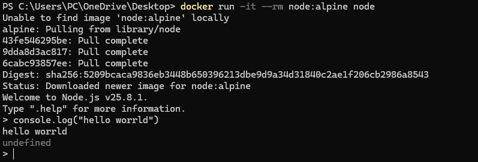
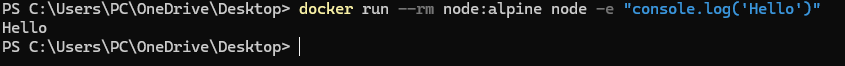

## Команды

```powershell
docker run -it --rm node:alpine node
```




```javascript
console.log("Hello from Docker!");
```


```powershell
docker run --rm node:alpine node -e "console.log('Hello')"
```

## Проверка
Я убедился, что контейнер запускает Node.js и выводит результат выполнения скрипта.

