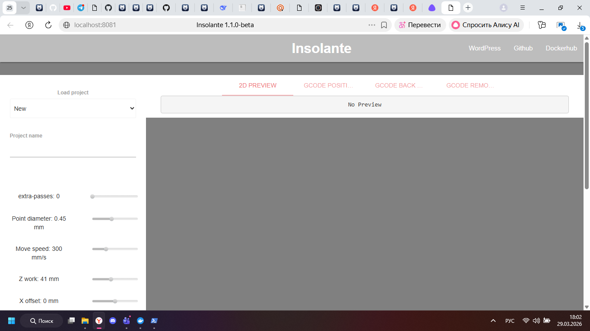

## Подготовка папки

```powershell
mkdir C:\insolante_data -Force
```

## Команда запуска

```powershell
docker run --rm -p 8081:5000 -d -e URL=http://localhost -e RPORT=8180 -e DEBUG=false -v C:/insolante_data:/opt/core/data ngargaud/insolante
```

## Проверка

```powershell
docker ps
```

После запуска я открыл адрес http://localhost:8081, вошел в приложение и проверил, что интерфейс загружается.

