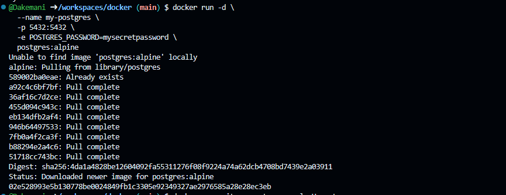
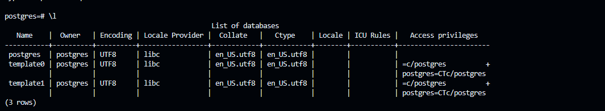

## 1. Запуск контейнера

```bash
docker run -d \
    --name my-postgres \
    -p 5432:5432 \
    -e POSTGRES_PASSWORD=mysecretpassword \
    postgres:alpine
```



## 2. Подключение к PostgreSQL

```bash
docker exec -it my-postgres psql -U postgres
```


## 3. Список баз данных

```sql
\l
```



## 4. Версия PostgreSQL

```sql
SELECT version();
```


