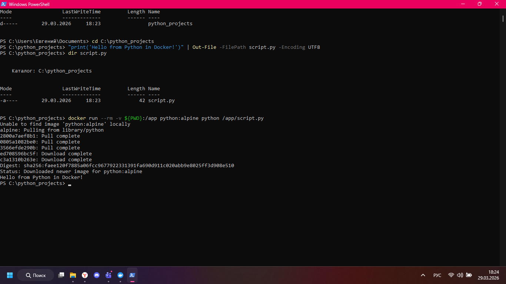

## Подготовка файла

```powershell
echo "print('Hello from Python in Docker!')" > script.py
```



## Команды

```powershell
docker run --rm -v ${PWD}:/app python:alpine python /app/script.py
docker run -it --rm python:alpine python
```
