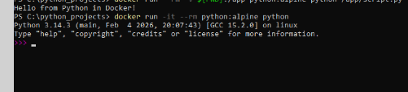

# Python

В этой работе я запустил Python-скрипт в контейнере и отдельно проверил интерактивный режим Python.
Контейнер Python удобен тем, что позволяет быстро запускать скрипты без установки интерпретатора и пакетов прямо в систему.

## Подготовка файла

```powershell
echo "print('Hello from Python in Docker!')" > script.py
```


## Команды

```powershell
docker run --rm -v ${PWD}:/app python:alpine python /app/script.py
docker run -it --rm python:alpine python
```
