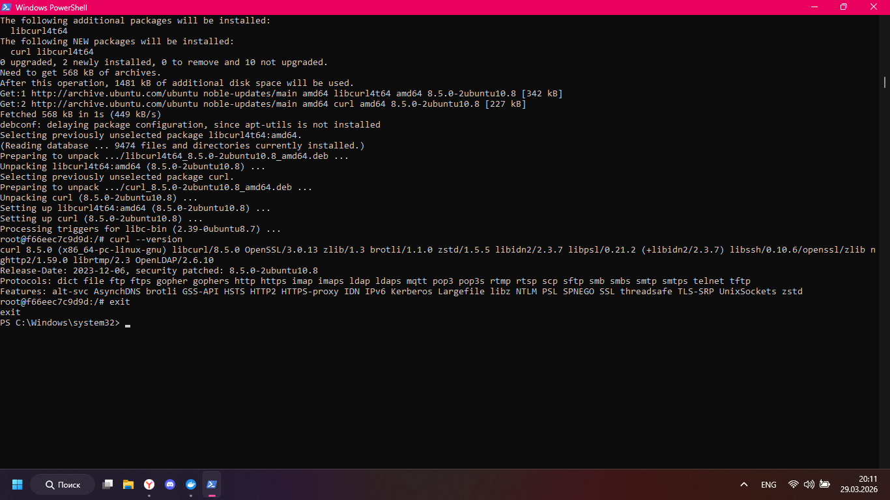
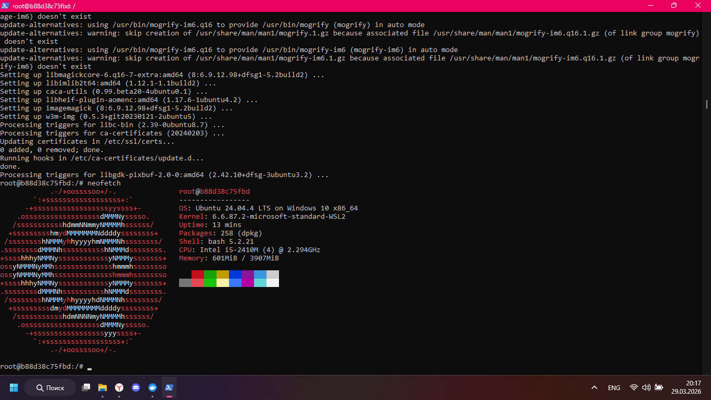

## Команда запуска

```powershell
docker run -it --rm ubuntu:latest /bin/bash
```



## Проверка

```powershell
apt update
apt install neofetch
curl --version
exit
```

Я проверил, что контейнер запускается, внутри работает пакетный менеджер и команды выполняются без ошибок.

