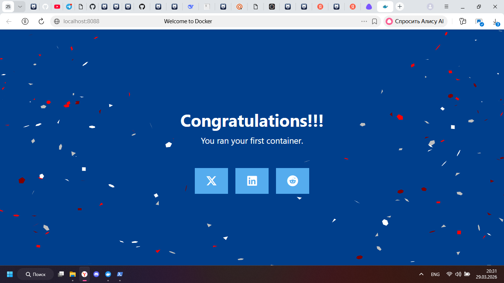
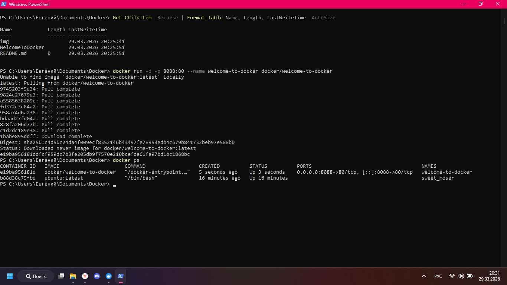

## Описание проекта
В этом проекте я познакомился с основами Docker: скачал образ, запустил контейнер, выполнил базовые команды внутри контейнера и установил дополнительное ПО.

## Подготовка
Перед началом работы проверил, что порт 8088 не занят:

```shell
netstat -tuln | grep :8088
```
(для Windows используется `netstat -aon | findstr :8088`)

Порт свободен — можно продолжать.

Получить версию установленного у вас Docker
```shell
docker version
```


