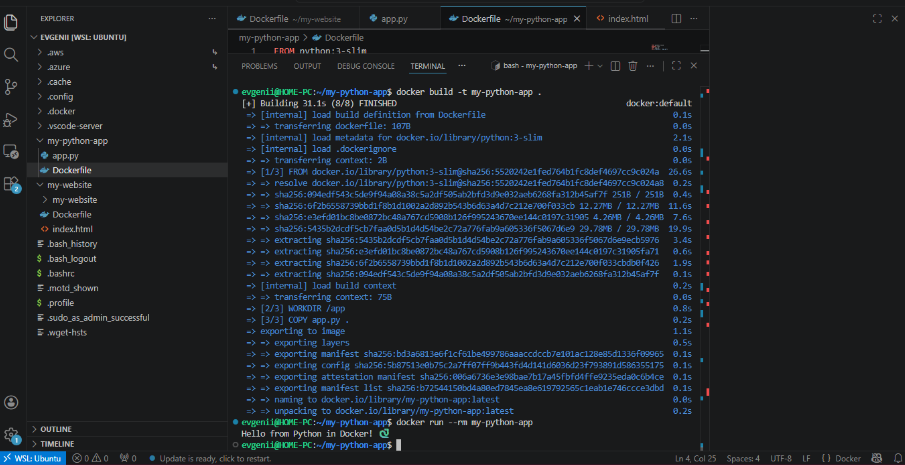

## Цель работы
Научиться создавать Docker-образ, запускать контейнер с веб-приложением и открывать к нему доступ через браузер.

## Задача
Создать простое веб-приложение на Python (или статический сайт), упаковать его в Docker-контейнер и запустить с пробросом порта для доступа из браузера.

---


## 1. Подготовка проекта

Создайте структуру проекта:

```bash
mkdir -p my-web-app && cd my-web-app
