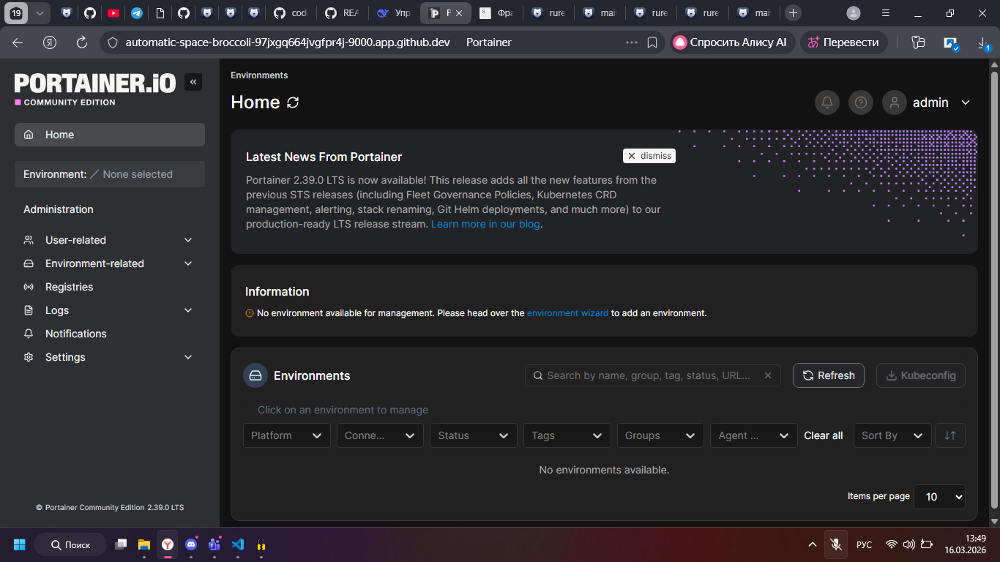

## Команда запуска
```bash
docker run -d \
  --name portainer \
  -p 9000:9000 \
  -p 9443:9443 \
  -v /var/run/docker.sock:/var/run/docker.sock \
  -v portainer_data:/data \
  --restart unless-stopped \
  portainer/portainer-ce:latest
```
## Домашняя страница
На `home.png` видно общий статус Docker-демона, разноцветные карточки-статусы и быстрые кнопки перехода в нужные разделы.

