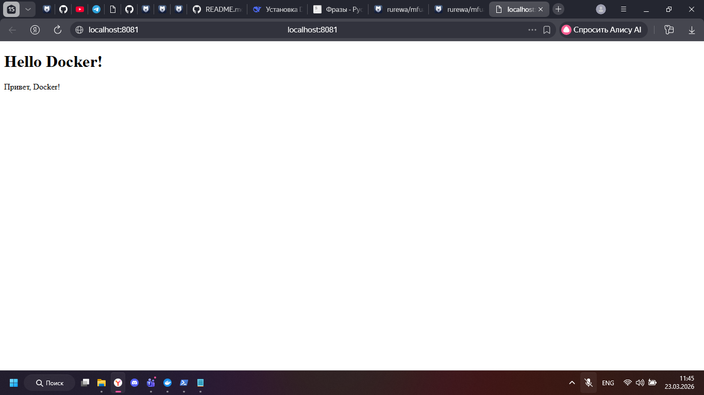
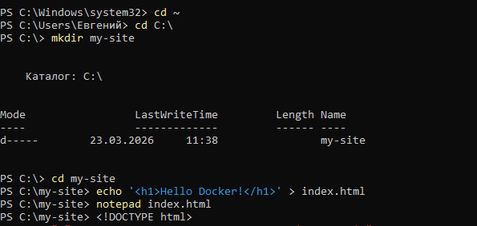
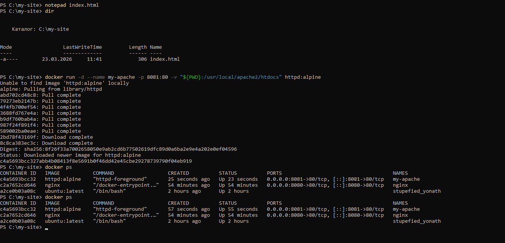
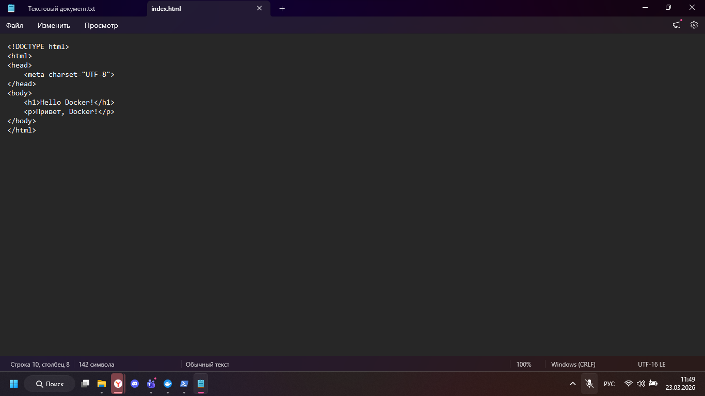

# Задание 4: Статический сайт на Apache





## Цель задания
Научиться запускать веб-сервер Apache в Docker контейнере, монтировать локальную папку с HTML-файлом и проверять работу сайта в браузере.

---

## Ход выполнения

### 1. Создание папки проекта

Перешёл в домашнюю директорию и создал папку `my-site`:

```powershell
cd ~
mkdir my-site
cd my-site