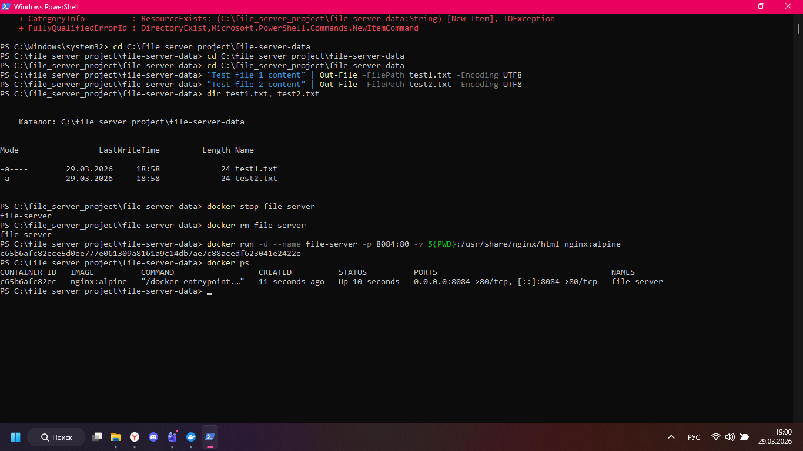
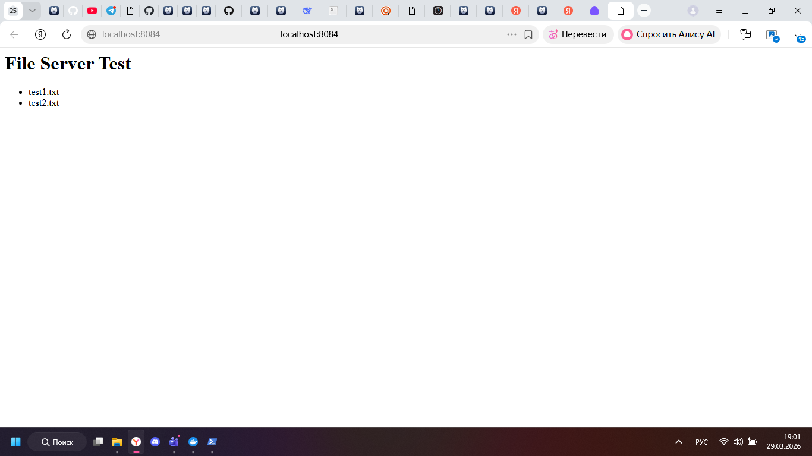

## Команда запуска

```powershell
docker run -d --name file-server -p 8084:80 -v ${PWD}:/srv halverneus/static-file-server:latest
```



## Проверка

```powershell
docker ps
```

После запуска я открыл адрес http://localhost:8084 и убедился, что сервер показывает содержимое папки.

